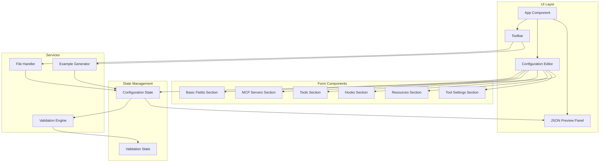

# Design Document: Kiro CLI Custom Agent UI

## Overview

The Kiro CLI Custom Agent UI is a React-based single-page application that provides a visual interface for creating and editing Kiro CLI custom agent configuration files. The application uses TypeScript for type safety, Zod for runtime validation, and follows a component-based architecture with clear separation between UI, state management, and business logic.

The application enables users to:
- Create new agent configurations through an intuitive form interface
- Import existing JSON configuration files
- Export configurations as properly formatted JSON
- Validate configurations in real-time against the schema
- Load pre-built example agent configurations as starting points

## Architecture



### Technology Stack

- **Framework**: React 18+ with TypeScript
- **Build Tool**: Vite
- **Styling**: Tailwind CSS
- **Validation**: Zod
- **Testing**: Vitest (unit) + Playwright (E2E)
- **State Management**: React useState/useReducer (no external library needed for this scope)

## Components and Interfaces

### Core Components

#### App Component
The root component that orchestrates the layout and manages global state.

```typescript
interface AppProps {}

// App manages:
// - Current configuration state
// - Validation state
// - JSON preview visibility toggle
```

#### Toolbar Component
Provides action buttons for file operations and example loading.

```typescript
interface ToolbarProps {
  onNew: () => void;
  onImport: (file: File) => void;
  onExport: () => void;
  onLoadExample: (exampleId: string) => void;
  isValid: boolean;
}
```

#### ConfigurationEditor Component
The main form container that renders all configuration sections.

```typescript
interface ConfigurationEditorProps {
  config: AgentConfiguration;
  onChange: (config: AgentConfiguration) => void;
  errors: ValidationErrors;
}
```

#### JSONPreviewPanel Component
Displays the live JSON preview with syntax highlighting.

```typescript
interface JSONPreviewPanelProps {
  config: AgentConfiguration;
  isVisible: boolean;
  onToggle: () => void;
  onCopy: () => void;
}
```

### Form Section Components

#### BasicFieldsSection
Handles name, description, prompt, model, keyboardShortcut, welcomeMessage, includeMcpJson.

```typescript
interface BasicFieldsSectionProps {
  config: Pick<AgentConfiguration, 'name' | 'description' | 'prompt' | 'model' | 'keyboardShortcut' | 'welcomeMessage' | 'includeMcpJson'>;
  onChange: (updates: Partial<AgentConfiguration>) => void;
  errors: ValidationErrors;
}
```

#### MCPServersSection
Manages the mcpServers object with add/remove/edit capabilities.

```typescript
interface MCPServersSectionProps {
  servers: Record<string, MCPServerConfig>;
  onChange: (servers: Record<string, MCPServerConfig>) => void;
  errors: ValidationErrors;
}
```

#### ToolsSection
Manages tools, toolAliases, and allowedTools arrays.

```typescript
interface ToolsSectionProps {
  tools: string[];
  toolAliases: Record<string, string>;
  allowedTools: string[];
  onChange: (updates: { tools?: string[]; toolAliases?: Record<string, string>; allowedTools?: string[] }) => void;
  errors: ValidationErrors;
}
```

#### HooksSection
Manages hooks for all trigger points.

```typescript
interface HooksSectionProps {
  hooks: HooksConfig;
  onChange: (hooks: HooksConfig) => void;
  errors: ValidationErrors;
}
```

#### ResourcesSection
Manages resources array including file URIs and knowledge bases.

```typescript
interface ResourcesSectionProps {
  resources: Resource[];
  onChange: (resources: Resource[]) => void;
  errors: ValidationErrors;
}
```

#### ToolSettingsSection
Manages toolsSettings for write, shell, and aws tools.

```typescript
interface ToolSettingsSectionProps {
  settings: ToolsSettings;
  onChange: (settings: ToolsSettings) => void;
  errors: ValidationErrors;
}
```

### Reusable UI Components

#### ArrayField
Generic component for managing array inputs with add/remove/reorder.

```typescript
interface ArrayFieldProps<T> {
  items: T[];
  onChange: (items: T[]) => void;
  renderItem: (item: T, index: number, onChange: (item: T) => void) => React.ReactNode;
  createItem: () => T;
  label: string;
  tooltip: string;
}
```

#### FieldWithTooltip
Wraps form fields with info icon and tooltip.

```typescript
interface FieldWithTooltipProps {
  label: string;
  tooltip: string;
  example?: string;
  error?: string;
  children: React.ReactNode;
}
```

## Data Models

### Agent Configuration Schema

```typescript
// Main configuration type
interface AgentConfiguration {
  name?: string;
  description?: string;
  prompt?: string;
  mcpServers?: Record<string, MCPServerConfig>;
  tools?: string[];
  toolAliases?: Record<string, string>;
  allowedTools?: string[];
  toolsSettings?: ToolsSettings;
  resources?: Resource[];
  hooks?: HooksConfig;
  includeMcpJson?: boolean;
  model?: string;
  keyboardShortcut?: string;
  welcomeMessage?: string;
}

// MCP Server configurations
type MCPServerConfig = LocalMCPServer | RemoteMCPServer;

interface LocalMCPServer {
  command: string;
  args?: string[];
  env?: Record<string, string>;
  timeout?: number;
}

interface RemoteMCPServer {
  type: 'http';
  url: string;
}

// Tool settings
interface ToolsSettings {
  write?: WriteToolSettings;
  shell?: ShellToolSettings;
  aws?: AWSToolSettings;
}

interface WriteToolSettings {
  allowedPaths?: string[];
}

interface ShellToolSettings {
  allowedCommands?: string[];
  deniedCommands?: string[];
  autoAllowReadonly?: boolean;
}

interface AWSToolSettings {
  allowedServices?: string[];
  autoAllowReadonly?: boolean;
}

// Resources
type Resource = string | KnowledgeBaseResource;

interface KnowledgeBaseResource {
  type: 'knowledgeBase';
  source: string;
  name: string;
  description?: string;
  indexType?: 'best' | 'fast';
  autoUpdate?: boolean;
}

// Hooks
interface HooksConfig {
  agentSpawn?: Hook[];
  userPromptSubmit?: Hook[];
  preToolUse?: ToolHook[];
  postToolUse?: ToolHook[];
  stop?: Hook[];
}

interface Hook {
  command: string;
  timeout_ms?: number;
  cache_ttl_seconds?: number;
}

interface ToolHook extends Hook {
  matcher: string;
}

// Validation errors
interface ValidationErrors {
  [path: string]: string;
}
```

### Zod Validation Schema

```typescript
import { z } from 'zod';

const keyboardShortcutPattern = /^(ctrl\+)?(shift\+)?[a-z0-9]$/;

const LocalMCPServerSchema = z.object({
  command: z.string().min(1, 'Command is required'),
  args: z.array(z.string()).optional(),
  env: z.record(z.string()).optional(),
  timeout: z.number().positive().optional(),
});

const RemoteMCPServerSchema = z.object({
  type: z.literal('http'),
  url: z.string().url('Must be a valid URL'),
});

const MCPServerConfigSchema = z.union([LocalMCPServerSchema, RemoteMCPServerSchema]);

const HookSchema = z.object({
  command: z.string().min(1, 'Command is required'),
  timeout_ms: z.number().positive().optional(),
  cache_ttl_seconds: z.number().positive().optional(),
});

const ToolHookSchema = HookSchema.extend({
  matcher: z.string().min(1, 'Matcher is required'),
});

const KnowledgeBaseResourceSchema = z.object({
  type: z.literal('knowledgeBase'),
  source: z.string().min(1, 'Source is required'),
  name: z.string().min(1, 'Name is required'),
  description: z.string().optional(),
  indexType: z.enum(['best', 'fast']).optional(),
  autoUpdate: z.boolean().optional(),
});

const ResourceSchema = z.union([
  z.string().min(1),
  KnowledgeBaseResourceSchema,
]);

const AgentConfigurationSchema = z.object({
  name: z.string().optional(),
  description: z.string().optional(),
  prompt: z.string().optional(),
  mcpServers: z.record(MCPServerConfigSchema).optional(),
  tools: z.array(z.string()).optional(),
  toolAliases: z.record(z.string()).optional(),
  allowedTools: z.array(z.string()).optional(),
  toolsSettings: z.object({
    write: z.object({
      allowedPaths: z.array(z.string()).optional(),
    }).optional(),
    shell: z.object({
      allowedCommands: z.array(z.string()).optional(),
      deniedCommands: z.array(z.string()).optional(),
      autoAllowReadonly: z.boolean().optional(),
    }).optional(),
    aws: z.object({
      allowedServices: z.array(z.string()).optional(),
      autoAllowReadonly: z.boolean().optional(),
    }).optional(),
  }).optional(),
  resources: z.array(ResourceSchema).optional(),
  hooks: z.object({
    agentSpawn: z.array(HookSchema).optional(),
    userPromptSubmit: z.array(HookSchema).optional(),
    preToolUse: z.array(ToolHookSchema).optional(),
    postToolUse: z.array(ToolHookSchema).optional(),
    stop: z.array(HookSchema).optional(),
  }).optional(),
  includeMcpJson: z.boolean().optional(),
  model: z.string().optional(),
  keyboardShortcut: z.string().regex(keyboardShortcutPattern, 'Invalid keyboard shortcut format').optional(),
  welcomeMessage: z.string().optional(),
});
```

### Example Agent Templates

```typescript
interface ExampleAgent {
  id: string;
  name: string;
  description: string;
  config: AgentConfiguration;
}

const exampleAgents: ExampleAgent[] = [
  {
    id: 'rust-backend',
    name: 'Rust Backend Agent',
    description: 'Specialized for Rust backend development with cargo and AWS',
    config: {
      name: 'rust-backend-agent',
      description: 'Specialized agent for Rust backend development',
      tools: ['read', 'write', 'shell', 'aws'],
      toolsSettings: {
        write: { allowedPaths: ['src/**', 'tests/**', 'Cargo.toml'] },
        shell: { allowedCommands: ['cargo build', 'cargo test', 'cargo fmt'] },
      },
      hooks: {
        postToolUse: [{ matcher: 'fs_write', command: 'cargo fmt --all' }],
      },
      resources: ['file://README.md', 'file://src/**/*.rs'],
    },
  },
  {
    id: 'frontend-react',
    name: 'Frontend React Agent',
    description: 'Optimized for React and TypeScript frontend development',
    config: {
      name: 'frontend-react-agent',
      description: 'Agent for React frontend development',
      tools: ['read', 'write', 'shell'],
      toolsSettings: {
        write: { allowedPaths: ['src/**', 'public/**', 'package.json'] },
        shell: { allowedCommands: ['npm test', 'npm run build', 'npm run lint'] },
      },
      resources: ['file://README.md', 'file://src/**/*.tsx', 'file://src/**/*.ts'],
    },
  },
  {
    id: 'devops-aws',
    name: 'DevOps AWS Agent',
    description: 'Focused on AWS infrastructure and DevOps tasks',
    config: {
      name: 'devops-aws-agent',
      description: 'Agent for AWS DevOps and infrastructure',
      tools: ['read', 'write', 'shell', 'aws'],
      toolsSettings: {
        aws: { allowedServices: ['s3', 'lambda', 'cloudformation', 'iam'], autoAllowReadonly: true },
        write: { allowedPaths: ['infra/**', 'terraform/**', '*.yaml', '*.yml'] },
      },
      resources: ['file://README.md', 'file://infra/**/*'],
    },
  },
];
```

### Service Interfaces

```typescript
// Validation Engine
interface ValidationEngine {
  validate(config: AgentConfiguration): ValidationResult;
  validateField(path: string, value: unknown): string | null;
}

interface ValidationResult {
  isValid: boolean;
  errors: ValidationErrors;
}

// File Handler
interface FileHandler {
  importFile(file: File): Promise<AgentConfiguration>;
  exportConfig(config: AgentConfiguration, filename?: string): void;
}

// Example Generator
interface ExampleGenerator {
  getExamples(): ExampleAgent[];
  getExample(id: string): ExampleAgent | undefined;
}
```


## Correctness Properties

*A property is a characteristic or behavior that should hold true across all valid executions of a system—essentially, a formal statement about what the system should do. Properties serve as the bridge between human-readable specifications and machine-verifiable correctness guarantees.*

### Property 1: Import/Export Round-Trip Consistency

*For any* valid AgentConfiguration object, exporting it to JSON and then importing that JSON back should produce an equivalent configuration object (with the same field values).

**Validates: Requirements 2.2, 2.4, 3.1**

### Property 2: Invalid JSON Error Handling

*For any* string that is not valid JSON or does not conform to the AgentConfiguration schema, the File_Handler should return an error result with a descriptive message rather than throwing an exception or producing undefined behavior.

**Validates: Requirements 2.3**

### Property 3: JSON Serialization Cleanliness

*For any* AgentConfiguration object, the exported JSON should:
- Be properly indented (2 spaces)
- Omit all fields that are undefined, null, or empty arrays/objects
- Produce valid JSON that can be parsed back

**Validates: Requirements 3.2, 3.4, 9.5**

### Property 4: Filename Generation Logic

*For any* AgentConfiguration object, the generated filename should be:
- `{name}.json` if the name field is set and non-empty
- `agent-config.json` if the name field is not set or empty

**Validates: Requirements 3.3**

### Property 5: Field State Synchronization

*For any* field modification in the Configuration_Editor, the internal state and JSON preview should both reflect the new value immediately (within the same render cycle).

**Validates: Requirements 1.2, 11.2**

### Property 6: Validation Completeness

*For any* AgentConfiguration object, the Validation_Engine should:
- Return a complete list of all validation errors
- Return an empty error list if and only if the configuration is valid
- Map each error to the specific field path that caused it

**Validates: Requirements 4.1, 4.2**

### Property 7: Keyboard Shortcut Format Validation

*For any* string provided as a keyboard shortcut, the Validation_Engine should:
- Accept strings matching the pattern `^(ctrl\+)?(shift\+)?[a-z0-9]$`
- Reject all other strings with a descriptive error message

**Validates: Requirements 4.4**

### Property 8: MCP Server Configuration Validation

*For any* MCP server configuration:
- Local servers (without `type: 'http'`) must have a non-empty `command` field
- Remote servers (with `type: 'http'`) must have a valid URL in the `url` field
- Server names within a configuration must be unique

**Validates: Requirements 4.5, 7.6**

### Property 9: Array Manipulation Invariants

*For any* array field in the configuration:
- Adding an item should increase the array length by exactly 1
- Removing an item should decrease the array length by exactly 1
- Reordering items should preserve all items (same set before and after)
- The array should support having multiple items (no artificial limits)

**Validates: Requirements 6.2, 6.3, 6.4, 8.4, 8.5**

### Property 10: Tool Alias Validation

*For any* tool alias entry:
- The original tool reference must match the pattern `@[a-zA-Z0-9_-]+/[a-zA-Z0-9_-]+`
- The alias name must match the pattern `^[a-zA-Z_][a-zA-Z0-9_]*$` (valid identifier)

**Validates: Requirements 12.2, 12.3**

### Property 11: Example Agent Validity

*For any* example agent provided by the Example_Generator:
- The configuration must pass all validation rules
- All MCP server configurations must be valid
- All tool references must be valid formats

**Validates: Requirements 13.3, 13.7**

## Error Handling

### File Import Errors

| Error Type | Cause | User Message | Recovery |
|------------|-------|--------------|----------|
| JSON Parse Error | Malformed JSON syntax | "Invalid JSON: {parse error details}" | Show error, keep current config |
| Schema Validation Error | Valid JSON but invalid schema | "Configuration error: {field} - {error}" | Show error, keep current config |
| File Read Error | Browser file API failure | "Could not read file. Please try again." | Show error, allow retry |

### Validation Errors

| Error Type | Cause | User Message |
|------------|-------|--------------|
| Required Field Missing | MCP server without command/url | "Command is required for local servers" / "URL is required for HTTP servers" |
| Invalid Format | Keyboard shortcut wrong format | "Invalid format. Use: [ctrl+][shift+]key (e.g., ctrl+a, shift+b)" |
| Invalid URL | HTTP server with malformed URL | "Must be a valid URL (e.g., https://api.example.com/mcp)" |
| Duplicate Name | Two MCP servers with same name | "Server name '{name}' already exists" |
| Invalid Identifier | Tool alias with invalid characters | "Alias must start with letter/underscore and contain only alphanumeric/underscore" |

### Export Errors

| Error Type | Cause | User Message | Recovery |
|------------|-------|--------------|----------|
| Validation Failure | Attempting to export invalid config | "Please fix validation errors before exporting" | Highlight errors, prevent export |
| Browser Download Failure | Browser blocks download | "Download failed. Check browser permissions." | Show error, allow retry |

### State Management Errors

- All state updates are wrapped in try-catch to prevent UI crashes
- Invalid state transitions log warnings but don't break the UI
- Corrupted localStorage data is detected and cleared with user notification

## Testing Strategy

### Unit Testing with Vitest

Unit tests focus on specific examples, edge cases, and isolated component behavior:

**Validation Engine Tests**
- Test each validation rule with valid and invalid inputs
- Test edge cases (empty strings, special characters, boundary values)
- Test error message formatting

**File Handler Tests**
- Test JSON parsing with various valid configurations
- Test error handling for malformed JSON
- Test filename generation logic

**Example Generator Tests**
- Test that each example is retrievable
- Test that examples have required fields

### Property-Based Testing with fast-check

Property-based tests verify universal properties across randomly generated inputs. Each test runs a minimum of 100 iterations.

**Configuration**:
- Library: fast-check
- Minimum iterations: 100 per property
- Shrinking enabled for failure case minimization

**Property Test Implementation**:

```typescript
// Feature: kiro-cli-custom-agent-ui, Property 1: Import/Export Round-Trip Consistency
test.prop([agentConfigArbitrary], { numRuns: 100 })('import/export round-trip', (config) => {
  const exported = exportToJson(config);
  const imported = importFromJson(exported);
  expect(imported).toEqual(config);
});

// Feature: kiro-cli-custom-agent-ui, Property 7: Keyboard Shortcut Format Validation
test.prop([fc.string()], { numRuns: 100 })('keyboard shortcut validation', (shortcut) => {
  const result = validateKeyboardShortcut(shortcut);
  const isValidFormat = /^(ctrl\+)?(shift\+)?[a-z0-9]$/.test(shortcut);
  expect(result.isValid).toBe(isValidFormat);
});

// Feature: kiro-cli-custom-agent-ui, Property 9: Array Manipulation Invariants
test.prop([fc.array(fc.string())], { numRuns: 100 })('array add increases length', (items) => {
  const before = items.length;
  const after = [...items, 'new-item'].length;
  expect(after).toBe(before + 1);
});
```

### End-to-End Testing with Playwright

Playwright tests validate complete user flows and UI interactions. Tests are written incrementally alongside feature development.

**Test Organization**:
```
tests/
  e2e/
    basic-form.spec.ts       # Basic form rendering and interactions
    import-export.spec.ts    # File import/export flows
    validation.spec.ts       # Validation error display
    array-fields.spec.ts     # Array manipulation (tools, resources)
    mcp-servers.spec.ts      # MCP server configuration
    hooks.spec.ts            # Hook configuration
    examples.spec.ts         # Example agent loading
    json-preview.spec.ts     # JSON preview functionality
```

**Test Execution Strategy**:
- Run after each major feature implementation
- CI pipeline runs full suite on every PR
- Failed tests block merging

### Test Coverage Goals

| Category | Target Coverage |
|----------|-----------------|
| Validation Engine | 95%+ |
| File Handler | 90%+ |
| Example Generator | 100% |
| React Components | 80%+ |
| E2E User Flows | All critical paths |
